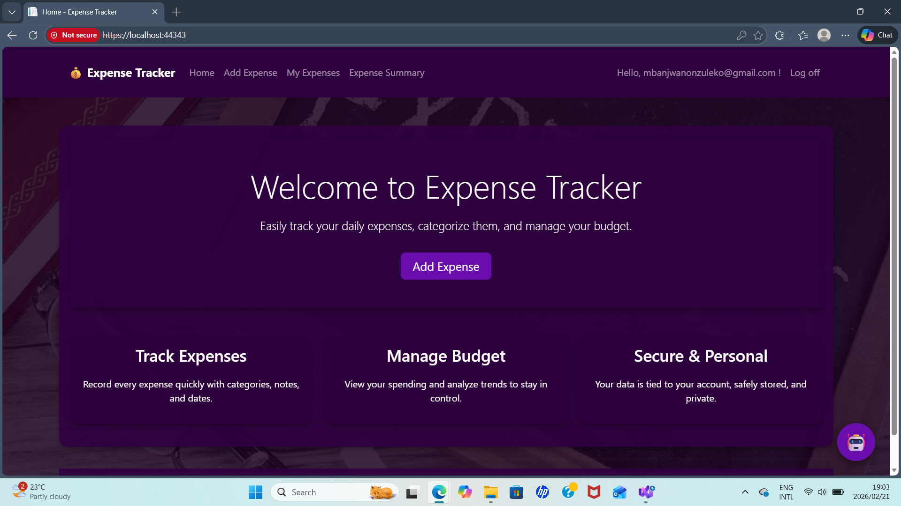
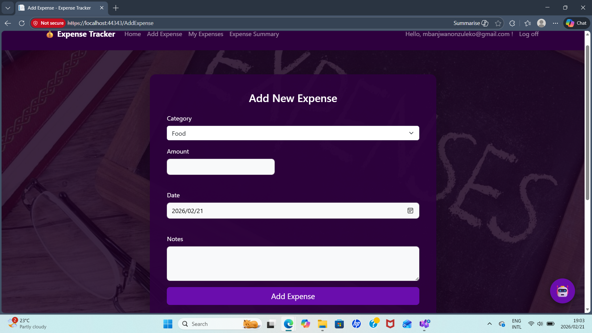
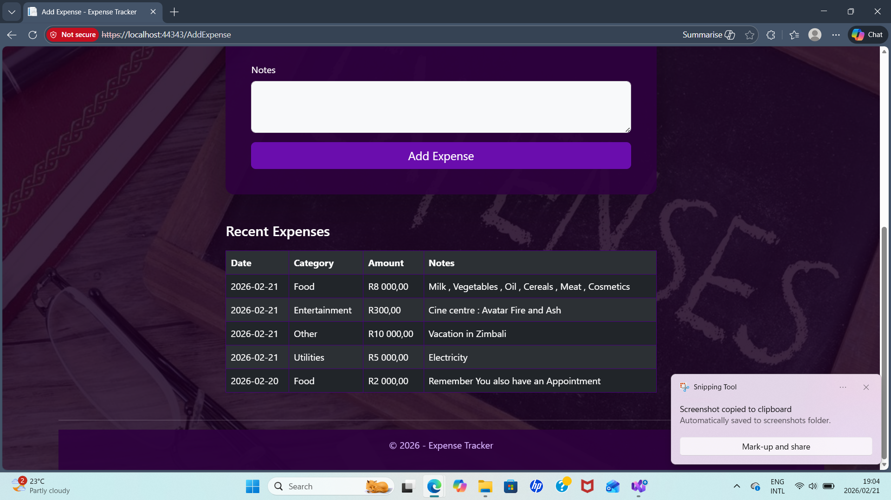
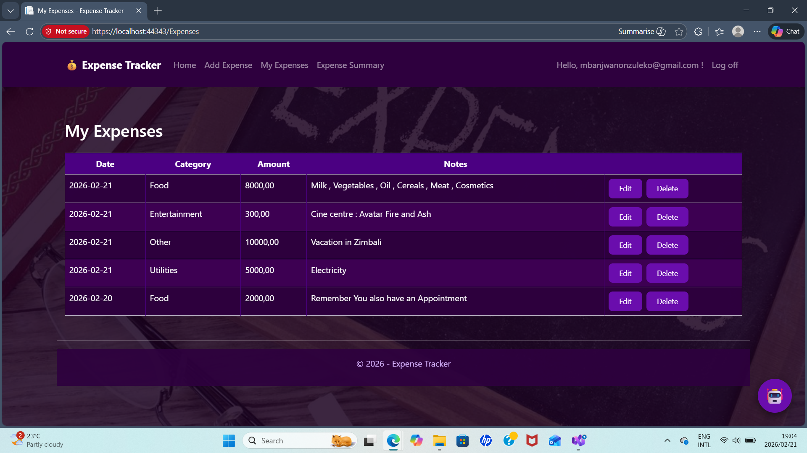
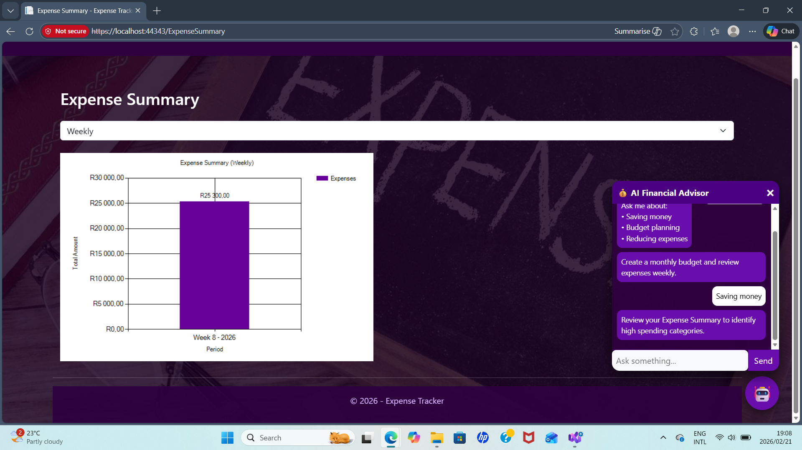
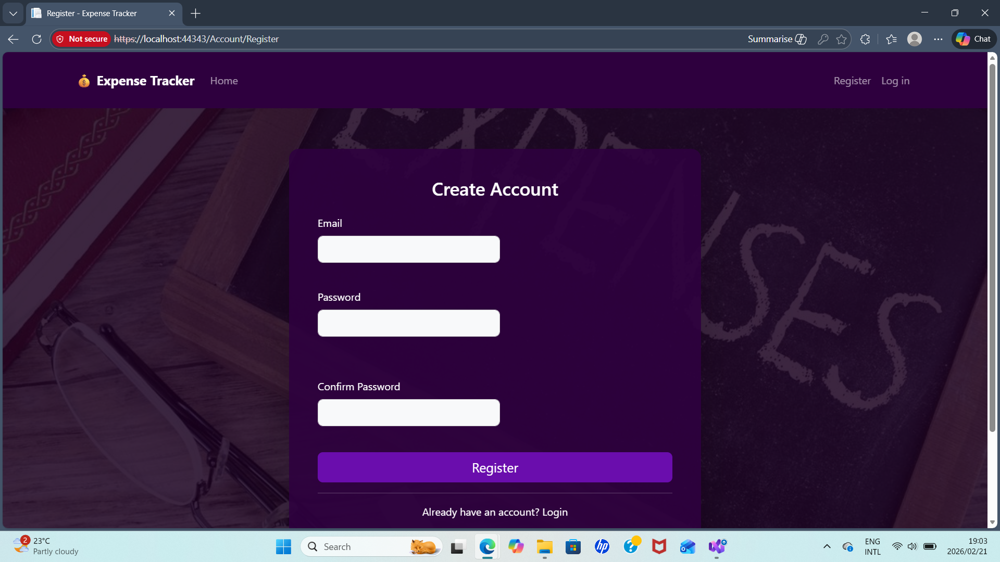
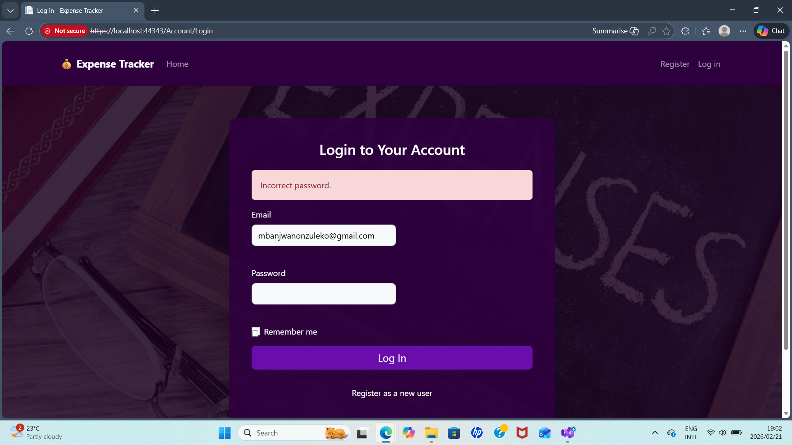

# 💰 Expense Tracker Web Application

A full-featured Expense Tracker built using ASP.NET WebForms and C#.

This application allows users to securely manage daily expenses, categorize spending, analyze summaries, and even receive AI-powered financial advice.

---

## 🚀 Features

- 🔐 User Authentication (Login/Register)
- ➕ Add Expenses
- ✏ Edit & 🗑 Delete Expenses
- 📊 Expense Summary Dashboard
- 🤖 AI Financial Advice Chatbot
- 🎨 Modern Dark Purple UI Theme
- 📱 Responsive Design

---

## 🛠 Tech Stack

- ASP.NET WebForms (.NET Framework 4.8)
- C#
- SQL Server / LocalDB
- Bootstrap 5
- JavaScript
- Git & GitHub

---

## 📸 Screenshots

### 🏠 Home Page


### ➕ Add Expense Page


### 📋 Expenses Management


### 📊 Expense Summary


### 🤖 AI Chatbot


---

## ⚙ Installation Guide

1. Clone the repository:

```bash
git clone https://github.com/Nonzu04/Expense-Tracker.git

## Screenshots

### Home Page


### Add Expense Page




### Expenses Table


### AI Chatbot


### Expense Summary


### Register Page


###Login Page
